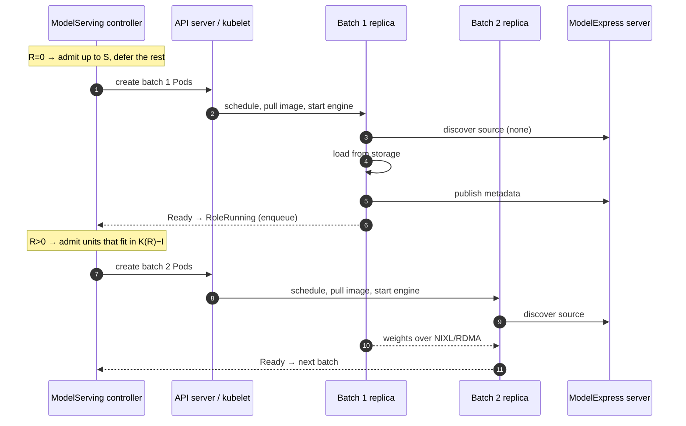

## Support ModelExpress P2P Bootstrap Acceleration

### Summary

When many ModelServing replicas start together, every role replica loads the full checkpoint from storage at once, and the fleet is ready only as fast as that contended load. [ModelExpress (MX)](https://github.com/ai-dynamo/modelexpress) copies post-processed weights from a ready serving replica over NIXL/RDMA (DeepSeek-V4-Pro, TP=8: 11s versus 8m53s for a cold Hugging Face pull). It only helps replicas that start **after** a compatible source is serving.

This proposal adds an optional `spec.bootstrapAccelerateStrategy` to ModelServing. Instead of creating every role replica at once, the controller creates them in source-aware batches:

- While a pool has no ready replica, it creates a first batch of up to `seedReplicas` role replicas. They find no source, so they load from storage and then become MX sources.
- Once replicas are ready, it creates the rest in batches of up to `sourceFanOut` per ready replica. They pull weights P2P from the ready replicas.

All replicas are identical: each one tries P2P first and falls back to storage. The controller only decides **when** to create them.

### Motivation

Weight loading dominates bootstrap of large models on initial deployment, scale-up, and rolling update. MX only helps if replicas start in source-aware order, and only the ModelServing controller sees every ServingGroup, role replica, revision, and desired count.

#### Goals

- Most role replicas start up via P2P from ready peers on initial deployment, scale-up, and rolling update.
- Bounded concurrency: the first batch doesn't saturate storage, and later batches don't saturate sources.
- Opt-in and revision-neutral; no behavior change without the field.
- Stateless: nothing beyond existing Pods and the datastore.
- No semantic change to recovery, rolling update (`maxUnavailable`, `maxSurge`, `partition`), or scale-down.

#### Non-Goals

- Deploying MX or its metadata backend, or configuring the engine (`--load-format modelexpress`, MX tuning variables). The controller only injects the MX endpoint, the source readiness URL, and Pod identity/address variables (see [Environment injection](#environment-injection)).
- Calling MX APIs from the controller. A Running role replica is treated as a source.
- Choosing the load path. MX's fallback chain (P2P → cache → storage → native loader) does that.
- ModelBooster integration, and cross-role or cross-layout sources.

### Proposal

#### Constraints from the current controller

| Fact | Consequence |
|---|---|
| A role replica is one entry Pod plus `workerReplicas` worker Pods ([Role](../../pkg/apis/workload/v1alpha1/servinggroup_types.go#L54-L86)). | Admit per role replica; one role replica is one MX source. |
| The revision and the role template hash are hashes of `template.roles` ([revision_util.go](../../pkg/model-serving-controller/utils/revision_util.go#L42-L71)). | A new `Role` field would re-hash and roll every ModelServing on upgrade, so the policy lives at `spec.bootstrapAccelerateStrategy`. |
| Every role replica is created by [scaleUpServingGroups](../../pkg/model-serving-controller/controller/model_serving_controller.go#L723) or [scaleUpRoles](../../pkg/model-serving-controller/controller/model_serving_controller.go#L1004). This covers initial deployment, scale-up, recovery, and rolling-update re-creation. The datastore is updated synchronously right after the Pods are created. | One admission hook covers every scenario, and no create expectations are needed. |
| A role becomes `RoleRunning` when all its Pods are Ready, which enqueues the ModelServing ([checkRoleReady](../../pkg/model-serving-controller/controller/model_serving_controller.go#L1916-L1962)). | Reused as "source ready" and as the trigger for the next wave. |
| With `schedulerName: volcano`, each ServingGroup has one PodGroup, created before its Pods. Its `minMember` counts $\min(\texttt{minRoleReplicas}[r], \texttt{role.replicas})$ replicas of every role $r$, and defaults to all of them ([calculateRequirements](../../pkg/model-serving-controller/podgroupmanager/manager.go#L350-L383)). `minRoleReplicas` is immutable. | A group's gang-required replicas must be created together, or the created ones never schedule. Replicas beyond them schedule on their own. The budgets $S$ and $K$ must be able to hold them. See [Fan-out and gang](#fan-out-and-gang). |
| A ServingGroup is Running only when every role has `role.replicas` Running replicas ([checkServingGroupReady](../../pkg/model-serving-controller/controller/model_serving_controller.go#L1888-L1914)), and missing replicas of an existing group are created by `manageRoleReplicasPerGroup` → `scaleUpRoles`. | A group can be created with only its gang-required replicas and completed later; until then it counts as unavailable. |
| Rolling update paces on `len(groups) - minAvailable - newUnavailable` ([manageRollingUpdate](../../pkg/model-serving-controller/controller/model_serving_controller.go#L1373)). | A group that is not created yet lowers `len(groups)` just like an unavailable one. See [Rolling update](#3-rolling-update). |

#### Batch creation

The controller changes when role replicas are created; a built-in ModelServing plugin injects MX environment variables and a bootstrap-configuration annotation into in-scope Pods. Templates and existing labels are unchanged. Every engine runs the same MX load path: it looks for a compatible ready source, loads P2P if there is one, and otherwise falls back to storage. The first batch simply finds no source.



#### User Stories (Optional)

##### Story 1

Initial deployment of 32 replicas with `seedReplicas: 2` and `sourceFanOut: 2`. The created role replicas go 2 → 6 → 18 → 32, and storage serves 2 cold loads instead of 32.

##### Story 2

Autoscaling from 4 to 16 replicas with `sourceFanOut: 3`. The 4 serving replicas are sources, so all 12 new ones are created at once and load P2P.

##### Story 3

Rolling update of the engine image on 32 replicas. The first new-revision replica loads from storage, and every later rollout step loads P2P from already-updated replicas.

#### Notes/Constraints/Caveats (Optional)

- The engine must be MX-enabled (vLLM ≥ 0.23 with `--load-format modelexpress`, or SGLang `remote_instance` with the `modelexpress` backend) and able to reach the MX server. Otherwise the policy only limits bootstrap concurrency.
- Readiness must imply that the weights are loaded; a `/health` probe is enough for that. A source publishes its MX metadata only after its readiness endpoint (`MX_ARTIFACT_READY_URL`, set through `modelExpress.readyURL` or defaulting to `/health` for vLLM) responds, so a `RoleRunning` replica may briefly not be discoverable. The next batch's scheduling and engine startup usually cover this gap; a reader that still finds no source falls back to storage. For strict P2P, add a readiness check that also confirms the source is published on the MX server.
- Later batches are scheduled, and pull their image, only after they are created, so these steps don't overlap the first batch's load. Pre-pull the engine image on GPU nodes to keep batches short. In exchange, deferred replicas hold no GPUs while they wait.
- A full-download init container still blocks P2P loading. Use a shared cache, `MX_MODEL_URI`, or no downloader.

#### Risks and Mitigations

| Risk | Mitigation |
|---|---|
| A first-batch replica never becomes Ready (unschedulable, or crash-looping) and stalls its pool. | Failed replicas are re-created by the recovery policy and re-admitted. An unschedulable replica would block the fleet without the feature too. Events and V(4) logs make it visible. Removing the policy creates everything on the next reconcile. |
| Between batches, other workloads take the capacity that later batches need. | Same as any scale-up; reserve capacity with a Volcano queue or quota. |
| `seedReplicas` is smaller than a group's gang requirement. | The controller raises $S$ and $K$ to at least $g$ at runtime, so a gang unit always fits eventually. See [Fan-out and gang](#fan-out-and-gang). |
| MX known issue (nvbug 6519532): a source may stop serving new readers after one of its readers is deleted. Rolling update and scale-down delete readers. | Affected replicas stall until `MX_TRANSFER_TIMEOUT`, then try another source or fall back to storage. Admission bounds concurrent fallbacks to $K$. Document a lower `MX_TRANSFER_TIMEOUT`. |
| Controller downgrade | Safe: an old controller simply creates the missing replicas. |
| Security | No new privileges or RBAC. In-scope Pods get plain/downward-API environment variables and a configuration-hash annotation; the MX address is user-supplied. |

### Design Details

#### 1. API

A new optional field on `ModelServingSpec`:

```go
// ModelServingSpec defines the specification of the ModelServing resource.
type ModelServingSpec struct {
	// ...existing fields...

	// BootstrapAccelerateStrategy creates role replicas in batches so that most of them
	// load model weights peer-to-peer from ready replicas instead of from storage.
	// +optional
	BootstrapAccelerateStrategy *BootstrapAccelerateStrategy `json:"bootstrapAccelerateStrategy,omitempty"`
}

// BootstrapAccelerateStrategyProvider identifies the peer-to-peer weight transfer system.
// +kubebuilder:validation:Enum={ModelExpress}
type BootstrapAccelerateStrategyProvider string

const (
	BootstrapAccelerateStrategyProviderModelExpress BootstrapAccelerateStrategyProvider = "ModelExpress"
)

// BootstrapAccelerateStrategy configures source-aware creation of role replicas.
type BootstrapAccelerateStrategy struct {
	// Provider is the weight transfer system used by the inference engines.
	// +kubebuilder:default=ModelExpress
	// +optional
	Provider BootstrapAccelerateStrategyProvider `json:"provider,omitempty"`

	// Roles limits bootstrap acceleration to the listed roles. Empty means all roles.
	// +listType=set
	// +optional
	Roles []string `json:"roles,omitempty"`

	// SeedReplicas is the number of role replicas per role that may be created while no
	// ready source exists. A percentage is taken of the desired role replicas
	// (spec.replicas * role.replicas) and rounded up, e.g. 10% of 3 is 1.
	// With gang scheduling, the effective budget is at least the role's minRoleReplicas
	// (default: all role replicas in one ServingGroup). Must resolve to at least 1
	// when the desired count is nonzero; a desired count of zero creates nothing.
	// +kubebuilder:validation:XIntOrString
	// +kubebuilder:default=1
	// +optional
	SeedReplicas *intstr.IntOrString `json:"seedReplicas,omitempty"`

	// SourceFanOut is the number of role replicas per role that may be starting
	// (created but not yet Running) for each ready replica of the same role.
	// +kubebuilder:validation:Minimum=1
	// +kubebuilder:default=1
	// +optional
	SourceFanOut *int32 `json:"sourceFanOut,omitempty"`

	// ModelExpress configures the ModelExpress provider. If unspecified, no MX
	// environment variables are injected and users configure the engine themselves.
	// +optional
	ModelExpress *ModelExpressConfig `json:"modelExpress,omitempty"`
}

// ModelExpressConfig holds values injected into the Pods of in-scope roles.
type ModelExpressConfig struct {
	// EngineContainers names the regular containers running the inference engine
	// in entry and worker Pods of in-scope roles. Only these containers receive MX envs.
	// +kubebuilder:validation:MinItems=1
	// +listType=set
	EngineContainers []string `json:"engineContainers"`

	// ServerAddress is the gRPC address (host:port) of the ModelExpress server. It is
	// injected as MX_SERVER_ADDRESS only if that variable is not already
	// set in the container.
	// +optional
	ServerAddress string `json:"serverAddress,omitempty"`

	// ReadyURL is the engine endpoint that MX polls before a source publishes its
	// metadata; it may differ from the Pod readiness probe. It is injected as
	// MX_ARTIFACT_READY_URL only if that variable is not already set in the container.
	// If empty, MX uses the engine's default (http://127.0.0.1:8000/health for vLLM).
	// +optional
	ReadyURL string `json:"readyURL,omitempty"`
}
```

```yaml
spec:
  replicas: 16
  bootstrapAccelerateStrategy:
    roles: ["prefill"]
    seedReplicas: 1
    sourceFanOut: 2
    modelExpress:
      engineContainers: ["engine"]
      serverAddress: modelexpress-server.modelexpress:8001
      readyURL: http://127.0.0.1:8000/health
  template:
    roles:
    - name: prefill
      replicas: 1
      entryTemplate:
        spec:
          containers:
          - name: engine
            image: <vllm-0.23+-with-modelexpress>
            args: ["serve", "/models/deepseek-v4", "--load-format", "modelexpress", "--tensor-parallel-size", "8"]
            readinessProbe:
              httpGet: {path: /health, port: 8000}
```

**Validation** ([validateModelServing](../../pkg/model-serving-controller/webhook/validator.go#L82)): `roles` must name existing roles; `seedReplicas` is a positive integer or `1%`–`100%`, with percentages rounded up; `sourceFanOut` ≥ 1 is enforced by the CRD schema. A seed count below the gang minimum is accepted and raised to $g$ at runtime, including the default of 1 (see [Fan-out and gang](#fan-out-and-gang)). `modelExpress.serverAddress`, if set, must be `host:port`; `modelExpress.readyURL`, if set, must be an absolute `http` or `https` URL. The field is mutable and takes effect on the next reconcile.

**Revision neutrality.** `ModelServingRevision` hashes roles; `CalRoleTemplateHash` hashes one role; `BuildRevisionData` captures roles, `schedulerName`, and user `plugins`. None includes `BootstrapAccelerateStrategy`. MX variables and the configuration annotation are added to generated Pods, not to the templates, so they do not change these revision inputs. Unit tests lock this in.

When `modelExpress` is specified, `engineContainers` must be nonempty and contain nonempty, unique container names, and the webhook requires every in-scope role's entry template and worker template (if any) to contain at least one of them.

The automatically enabled MX plugin is not written into `spec.plugins` or the ControllerRevision. Policy edits therefore do not trigger a rollout, but changes to effective MX configuration start a new admission pool as described below.

#### 2. Admission

Admission runs per **pool** = (role name, role template hash, effective bootstrap-configuration hash). A missing replica's role template comes from the spec, or from the ControllerRevision for partition-protected ordinals.

**Configuration identity.** A shared pure helper calculates a versioned hash of the role's bootstrap rendering inputs: provider, whether the role is in scope, `modelExpress.serverAddress`, the sorted `modelExpress.engineContainers` selection, and the ordered user-plugin configuration and scope used to render its Pods. Entry and worker templates, including endpoint-alias overrides in `env` and `envFrom`, are already covered by the role template hash. Canonicalize plugin defaults and JSON keys while preserving plugin execution order. Hashing the endpoint and plugin configuration conservatively prevents edits from reusing sources even when `CalRoleTemplateHash` is unchanged; an overridden endpoint may cause an unnecessary seed batch, but never false source reuse. The cost is that any effective plugin configuration change, even one unrelated to MX, restarts the pool with a seed batch. Seed count, fan-out, replica counts, `modelExpress.readyURL` (it changes when a source publishes, not what it serves), and Pod-specific values (name, UID, IP, worker index) are excluded.

The MX plugin persists this hash as `workload.serving.volcano.sh/bootstrap-config-hash` on each created Pod. Admission computes the expected hash with the same helper and counts a replica as a source only when **all** its entry/worker Pods carry matching role-template and configuration hashes. Pods without the annotation, including replicas created before acceleration was enabled, are not sources. The datastore retains the observed identity from Pods, and `syncAll` reconstructs it after restart; it must never substitute the current spec's hash for a missing annotation.

Changing the endpoint, adding a role to scope, or changing effective plugin configuration leaves existing Pods untouched. New replicas enter the new pool with $R=0$ unless matching sources already exist, rather than using a full fan-out from unconfigured or old-endpoint replicas. Changing only `seedReplicas` or `sourceFanOut` reuses the pool. External changes behind `envFrom` or a stable endpoint are not detectable by this hash; users must roll the affected Pods when source compatibility changes.

Per pool, from the datastore:

- $R$: matching role replicas that are `RoleRunning`.
- $I$: matching created role replicas that are neither `RoleRunning` nor `Deleting`.

- $D = \texttt{spec.replicas} \times \texttt{role.replicas}$.
- $g$: the **gang minimum**, the replicas of this role that one ServingGroup must start together. With a PodGroup, $g = \min(\texttt{role.replicas}, \max(1, \texttt{minRoleReplicas}[r]))$, where `minRoleReplicas[r]` defaults to `role.replicas`. Without a PodGroup, $g = 1$.
- $S = \min\bigl(D,\ \max(g,\ \lceil \texttt{seedReplicas} \rceil_D)\bigr)$.

$$
K =
\begin{cases}
\max(g,\ \texttt{sourceFanOut} \times R) & R > 0 \\
S & R = 0
\end{cases}
$$

$K$ caps unfinished bootstraps, so the free budget is $K - I$. Replicas that don't fit stay missing until a later reconcile.

**Units.** Replicas are created in units that keep gang scheduling satisfiable:

- **New ServingGroup:** its PodGroup plus its **gang core**, i.e. role ordinals $0..g_r-1$ of every in-scope role $r$, plus all replicas of out-of-scope roles. The group's other in-scope role replicas are left for `scaleUpRoles`.
- **Existing ServingGroup:** if some roles have fewer than $g_r$ non-Deleting replicas (for example after `RoleRecreate`), the replicas missing from the core, across all such roles, form one unit. Every other missing replica (role scale-up, non-core replicas, `RoleRollingUpdate`) is a unit of one.
- A unit is admitted only if it fits in every in-scope pool it touches: $u_p \le K_p - I_p$, where $u_p$ is the unit's replicas in pool $p$. Its replicas are then added to $I_p$. Out-of-scope pools are not limited.

**Order:** lowest missing ordinal first, which matches `forEachMissingOrdinal`. Once a unit is denied, every later unit that touches one of its pools is denied for the rest of the reconcile, so a smaller unit never overtakes a gang core and starves it.

##### Fan-out and gang

`sourceFanOut` is a per-pool ratio of starting replicas to ready sources. A gang core is the smallest thing that can be scheduled. When the two disagree, the gang wins:

- **Floor.** $K \ge g$ and $S \ge g$. Without the floor, a pool whose missing replicas are all gang cores would deadlock whenever $\texttt{sourceFanOut} \times R < g$, since no core could be admitted and $R$ could never grow. The cost is that one core may start with more replicas than the fan-out allows. For example, with $g = 4$, $R = 1$, and `sourceFanOut: 1`, all 4 replicas pull from 1 source.
- **Whole units only.** A unit is admitted only if it fits in every in-scope pool; admission never increases $I$ above the current $K$. If sources become unready or the policy lowers $K$ below the existing $I$, no new replicas are admitted until enough in-flight replicas finish. Once $I_p \to 0$, every unit fits, because $u_p \le g_p \le K_p$.
- **Per role.** A multi-role core needs room in each pool. Each role counts only its own replicas as sources, even when MX could match them across roles. This is conservative.
- **Aggregate, not per source.** The controller uses $K = \max(g, \texttt{sourceFanOut} \times R)$ when $R>0$, not a per-source reader limit. MX picks a source for each reader (randomly by default). `MX_P2P_SOURCE_SELECTOR=rendezvous_hash` can improve distribution but does not guarantee an even spread or enforce a hard per-source cap.
- **Relationship to `minRoleReplicas`.** `minRoleReplicas` is a per-ServingGroup scheduling requirement, while `seedReplicas` is a per-pool cold-start budget across groups. The former sets a lower bound on the latter's effective value, not an additional batch limit. For example, with $g=2$ and `seedReplicas: 3`, one new group gets its 2-replica core; another whole core cannot fit in the remaining budget. The default `seedReplicas: 1` remains valid even if $g>1$, and the runtime floor handles both integers and percentages.
- **Tip:** a lower `minRoleReplicas` shrinks the core, so fewer replicas cold start and the fan-out is exceeded less.

**Example.** Prefill/decode (PD), `replicas: 4`, each group has 2 prefill + 4 decode, `minRoleReplicas: {prefill: 1, decode: 2}`, so $g_P = 1$ and $g_D = 2$. `seedReplicas: 1` and `sourceFanOut: 1`; the effective cold-start budgets are 1P and 2D because gang scheduling takes precedence.

| Batch | $(R_P, R_D)$ | $(K_P, K_D)$ | Created |
|---|---|---|---|
| 1 | (0, 0) | (1, 2) | Group 0 core (1P + 2D, cold). Group 1's core doesn't fit $K_P$. |
| 2 | (1, 2) | (1, 2) | Group 1 core (1P + 2D, P2P). |
| 3 | (2, 4) | (2, 4) | Groups 2 and 3 cores. |
| 4 | (4, 8) | (4, 8) | All 4 non-core P and 8 non-core D replicas. |

Storage serves 3 cold loads instead of 24.

**Examples** ($D = 8$, $g = 1$; cumulative created replicas):

| Policy | Batches |
|---|---|
| `seedReplicas: 1`, `sourceFanOut: 1` | 1 → 2 → 4 → 8 |
| `seedReplicas: 1`, `sourceFanOut: 2` | 1 → 3 → 8 |
| `seedReplicas: 1`, `sourceFanOut: 3` | 1 → 4 → 8 |
| Scale 8 → 16, `sourceFanOut: 1` | 8 → 16 |

#### 3. Rolling update

`manageRollingUpdate` is unchanged. Replicas it deletes are re-created through `scaleUpServingGroups`/`scaleUpRoles` on a later reconcile, and those pass admission like any other missing replica.

**R1. A changed role template or effective bootstrap configuration is a new pool.** It starts with a first batch of $S$; replicas with different template or configuration hashes are not counted in its $R$.

- Why not share sources across revisions: MX matches sources by `SourceIdentity` (model, revision, TP/PP/EP, dtype, quantization, engine/torch/CUDA versions, GPU arch). The controller can't tell from a template diff whether that identity changed. Counting incompatible old replicas would release a large batch that all falls back to storage.
- If the change is identity-neutral (for example, resources, probes, `--max-num-seqs`), the new pool's first batch still finds old-revision sources through MX and loads P2P. The only cost is that the first batch is `seedReplicas` wide.
- Roles whose template and effective configuration didn't change keep their pool. Under `ServingGroupRollingUpdate`, their re-created replicas join the existing pool (usually $R > 0$) and are admitted with its budget.

**R2. Pacing stays with the rollout.** A deferred group is absent from the datastore, which lowers `len(groups)` in `maxScaleDown` exactly as one unavailable new group would. `maxUnavailable` is never exceeded.

- Only the first step of a changed pool is narrowed, to $S$.
- Once $R \ge$ `maxUnavailable + maxSurge`, `sourceFanOut: 1` covers the whole window and the rollout runs at its normal pace.
- With `maxSurge` ≥ 1, the first batch is surge replicas and loads while old capacity is intact.

**R3. Outdated replicas** already exist and are not affected. Missing partition-protected ordinals are re-created from their ControllerRevision and admitted in their old pool.

**R4. Deleting sources.** A replica pulling from a deleted source retries another candidate (MX tries up to 3) and then falls back to storage. On clean shutdown MX marks the source `STALE`, and with the Kubernetes backend its metadata is garbage-collected through the Pod owner reference.

**R5. Rollback.** Reverting to a template and effective configuration whose hashes still have Running replicas resolves to that pool, so re-created replicas are admitted with $R > 0$ immediately.

**R6. `RoleRollingUpdate`.** The same rules apply per role, and unchanged roles are not touched. In PD disaggregation, updating only `prefill` restarts from a first batch only in the prefill pool.

**Example.** `replicas: 8`, `maxUnavailable: 2`, `maxSurge: 0`, `seedReplicas: 1`, `sourceFanOut: 1`, new engine image:

1. The rollout deletes groups 7 and 6. The new pool has $R=0$, so only group 6 is created, and 7 stays missing. `maxScaleDown` = 7 − 6 − 1 = 0.
2. Group 6 is Running, so $R=1$ and group 7 is created. `maxScaleDown` = 8 − 6 − 1 = 1, and group 5 is deleted.
3. Group 7 is Running, so $R=2$ and group 5 is created. From here $K = R \ge 2$ covers the window, and the rollout keeps 2 groups in flight.

Storage serves 1 cold load instead of 8.

#### 4. Controller changes

A new package `pkg/model-serving-controller/bootstrap/` holds a pure `Admitter`. [syncModelServing](../../pkg/model-serving-controller/controller/model_serving_controller.go#L545-L589) builds one `Admitter` per reconcile from the datastore ($R$, $I$ per pool) and passes it down both creation paths:

```text
syncModelServing
├─ admitter := bootstrap.NewAdmitter(ms, store)
├─ syncServingGroupReplicas → scaleUpServingGroups       (A) new groups
├─ syncRoleReplicas → for each group: core deficit      (B)
│                   → for each role:  scaleUpRoles       (C) units of one
└─ rollout, services, status                              unchanged
```

- **(A) New groups.** For each missing ordinal, `Admit` the unit (the gang core of in-scope roles). If it is admitted, create the PodGroup (`minMember` unchanged), then only the core's in-scope replicas plus all out-of-scope replicas, then `AddServingGroup`. If it is denied, the group is not created: no PodGroup and no Pods.
- **(B) Core deficit.** Before the per-role loop, if an existing group is missing part of its core (for example after `RoleRecreate`), those replicas across all roles are admitted as one unit and created together. If the unit is denied, (C) skips them.
- **(C) Remaining replicas.** In `scaleUpRoles`, each missing in-scope replica beyond the core is a unit of one. Out-of-scope roles are not gated.
- A denied unit blocks its pools for the rest of the reconcile ([Order](#2-admission)). Admitted replicas are added to $I$, and they are also in the datastore right after creation, so the next reconcile sees them.
- **Datastore.** Each role replica records its observed bootstrap-configuration hash next to `RoleTemplateHash`, derived from its Pods' annotations on creation, Pod events, and `syncAll`. It is empty when any Pod lacks the annotation or the Pods disagree.
- **Wake-ups.** No new handlers. `RoleRunning` transitions already enqueue (the next batch), and so do deletions (lower $I$) and spec edits.
- **Disabling** the policy: the next reconcile creates every missing replica. **Crash safety:** only the configuration identity is persisted on Pods, not batch progress; after a restart, `syncAll` rebuilds the datastore from observed Pods and admission is recomputed.
- **Events:** `BootstrapBatchCreated` with the pool and the count; deferred counts are logged at V(4).

##### Environment injection

A built-in `modelexpress` plugin implements the existing [OnPodCreate hook](../../pkg/model-serving-controller/plugins/manager.go#L86-L100). `buildPluginChain` appends it automatically after user plugins when `bootstrapAccelerateStrategy.provider` is `ModelExpress`, scoped to the strategy's roles and both entry and worker Pods. Users do not need a duplicate `spec.plugins` entry; explicit registration of this managed plugin is rejected. Its `OnPodReady` is a no-op. Admission remains in the controller because a per-Pod plugin cannot defer a whole gang unit.

The plugin injects the variables below **only into inference-engine containers**, selected by `modelExpress.engineContainers` from `pod.spec.containers`, and writes the configuration-hash annotation on the Pod. Init containers and unselected regular containers (including sidecars) are never modified. Besides the webhook check, the controller renders all Pods of an admitted unit before creating any; if a user plugin leaves a Pod without a selected engine container, the whole unit fails with a configuration event and nothing is created. The plugin does not infer engine containers from images or command lines. If `modelExpress` is omitted, no environment variables are injected; users configure their engine containers themselves. Container selection participates in the bootstrap-configuration hash.

`GenerateEntryPod` and `GenerateWorkerPod` remain unchanged. A variable already defined in a selected container wins, including values added by earlier plugins. Inject `MX_SERVER_ADDRESS` and `MX_ARTIFACT_READY_URL` only when the variable is absent and the corresponding field is nonempty; no deprecated endpoint variable is injected. This integration requires an MX client that supports `MX_SERVER_ADDRESS`. Clients that read only the deprecated `MODEL_EXPRESS_URL` (for example, TRT-LLM live transfer) are unsupported, and because MX prefers `MODEL_EXPRESS_URL` when both are set, templates or images (for example, a Dockerfile `ENV`) that set it must remove it. Injected `env` entries take precedence over `envFrom`, and the plugin does not resolve `envFrom`; users who supply any variable below through `envFrom` must move it to `env` (or leave the corresponding `modelExpress` field empty).

For the central-server deployment covered by this proposal, inject only the following ([MX P2P environment variables](https://github.com/ai-dynamo/modelexpress/blob/main/docs/DEPLOYMENT.md#p2p-environment-variables)):

| Variable | Value | Why |
|---|---|---|
| `MX_SERVER_ADDRESS` | `modelExpress.serverAddress`; inject only when the variable is absent and the address is nonempty | The client's gRPC endpoint; do not assume `localhost:8001` points to an external MX server. |
| `MX_ARTIFACT_READY_URL` | `modelExpress.readyURL`; inject only when the variable is absent and the URL is nonempty | The engine endpoint a source polls before publishing. Set it when the engine's port or path differs from the MX default, or when the Pod readiness probe checks a different endpoint; a URL that never responds keeps the source from ever publishing. |
| `MX_WORKER_HOST` | Downward API `status.podIP` | The address that readers use to reach this source. Auto-detection can pick an unroutable interface on multi-NIC GPU nodes. |

MX client defaults already suit this topology and are not injected: an empty `MX_METADATA_BACKEND` uses the central server, `MX_P2P_METADATA` defaults to `1`, and `MX_METADATA_PORT`/`MX_WORKER_GRPC_PORT` default to the fixed base ports 5555/6555 (never set them to 0 in Kubernetes).


Pod IP is a sensible default for `MX_WORKER_HOST`, not a guarantee of RDMA reachability. Users must override it when the advertised address needs another interface. NetworkPolicy and the GPU/RDMA device allocation must permit the worker gRPC/NIXL port ranges and data-plane traffic. Multiple engines sharing one Pod network, or host-network Pods sharing a node, need nonoverlapping port ranges; Kthena does not allocate those automatically.

**Configuration ownership.** Keep workload-specific values in `modelExpress` or the selected engine container's template, not controller arguments. The `serverAddress`, `readyURL`, and `engineContainers` fields suffice; Pod identity/IP are derived and MX supplies stable port defaults. Custom ports, `MX_NIXL_BACKEND` (`UCX` for InfiniBand/RoCE, `LIBFABRIC` for AWS EFA), NIC pinning, source selection, and timeouts can be set explicitly in the engine container's `env`. No controller-wide flags or arbitrary env passthrough API are needed.

Do not guess a model revision or compile-cache digest from the ModelServing revision hash. Leave `MX_MODEL_REVISION` to the engine or an explicit checkpoint-version override; it labels source identity and does not pin the engine's checkpoint. Artifact transfer is opt-in: users setting `MX_ARTIFACT_TRANSFER=1` should also supply distinct `MX_ARTIFACT_COMPILE_CONFIG_DIGEST` values for incompatible prefill/decode compilation settings. `VLLM_PLUGINS=modelexpress` is needed only for vLLM older than 0.23, not injected universally. The decentralized `k8s-service` backend needs its own Service/rank routing and pinned source identity, so it is outside this central-server integration.

The injection happens at Pod creation, so changing `serverAddress` affects only new Pods and doesn't trigger a rollout; only replicas with the new effective configuration can release their subsequent batches.

| Feature | Behavior |
|---|---|
| Gang scheduling / network topology | A group's gang core is created together with its PodGroup, and budgets are at least $g$ ([Fan-out and gang](#fan-out-and-gang)). Deferred groups get no PodGroup yet. |
| `RoleRecreate` / `ServingGroupRecreate` recovery | Re-created replicas pass admission, usually with $R > 0$. |
| Pod re-creation inside an existing role replica | Not gated. The replacement Pod runs the MX plugin; a replica with mixed configuration hashes is not a source until all its Pods match the target pool. |
| Scale-down | Deferred replicas don't exist, so there is nothing to delete. |
| kthena-router | Unchanged. |
| User plugins | Existing hooks are unchanged; the managed MX plugin runs last. Effective plugin configuration participates in source identity. |

#### Test Plan

Unit tests (table-driven, `-race` where concurrent):

- **Admitter:** $S$/$K$ with integer and percentage seeds, the gang floor $g$, $D=0$, whole-unit fit across pools, blocking after a denied unit, $I > K$ after sources become unready or the policy is lowered, and the batch sequences in the examples above.
- **Pool identity:** the configuration hash is stable under plugin JSON key reordering and changes with the endpoint, scope, engine containers, and plugin configuration; replicas with missing or mismatched annotations are not sources; `syncAll` rebuilds the observed hash without substituting the current spec's.
- **Controller:** new-group core creation with its PodGroup, core-deficit units, units of one, out-of-scope roles ungated, a failed unit render creating nothing, disabling the policy, and rolling-update pacing (`maxUnavailable`, `maxSurge`, `partition`, rollback).
- **Revision neutrality:** adding, editing, or removing the strategy does not change `ModelServingRevision`, `CalRoleTemplateHash`, or `BuildRevisionData`.
- **Environment injection:** only selected engine containers change; init containers and sidecars are untouched; `readyURL` maps to `MX_ARTIFACT_READY_URL`; existing `MX_SERVER_ADDRESS`, `MX_ARTIFACT_READY_URL`, and other variables win; changing `readyURL` keeps the pool; nothing is injected when `modelExpress` is omitted; `MODEL_EXPRESS_URL` and MX defaults are never injected.
- **Webhook:** unknown roles, invalid `seedReplicas`, malformed `serverAddress` or `readyURL`, missing engine containers in templates, and explicit registration of the managed plugin.

E2E (`test/e2e/controller-manager`): a multi-replica ModelServing with the strategy and a stub engine (no MX needed) verifies batch order, gang cores with `schedulerName: volcano`, and a rolling update.

### Alternatives

- **Create all Pods and gate the engine with an injected init container** (released by a Pod label through the downward API): overlaps scheduling and image pulls with the first batch's load. However, waiting Pods hold GPUs, it needs Pod `patch` RBAC, a gate image, and downward-API refresh latency, and a gate crash triggers recovery.
- **`schedulingGates`:** adds Pod patching and interacts with PodGroup `minMember`, with no clear gain over deferring creation.
- **Policy on `Role`:** re-hashes every existing role on upgrade and rolls the fleet.
- **Plugin-only batching:** plugins only have per-Pod hooks and cannot defer a whole gang unit. Use a plugin for MX Pod configuration, but keep admission in the controller.
- **Pods self-coordinate via MX/Redis:** needs backend credentials in every Pod and has no view of desired replicas or rollouts.
- **Query MX `ListSources`:** more precise (catches wedged sources) but couples the controller to MX networking and auth. Possible later behind `provider`.
- **Share pools across revisions** (for example, a user-declared source key): removes the first batch for identity-neutral updates, but a misconfiguration causes a fallback stampede.